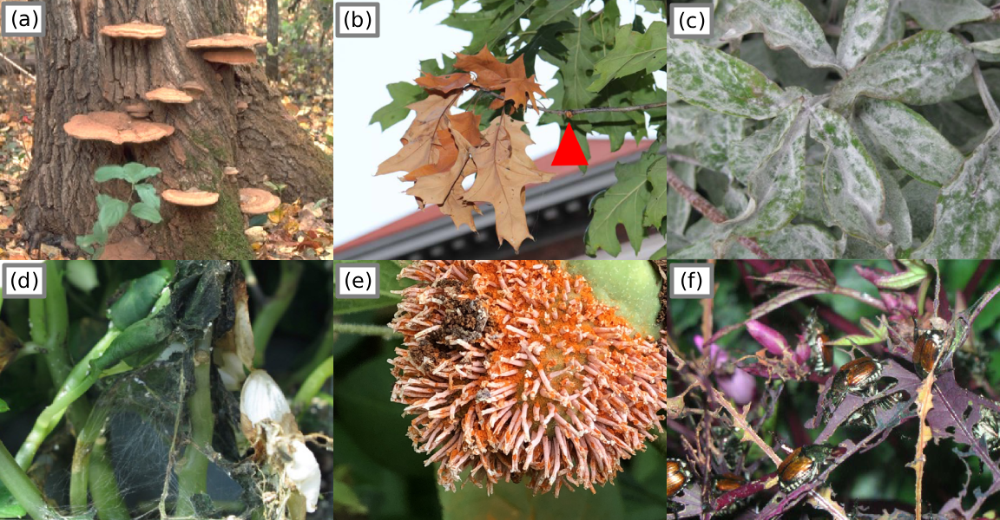
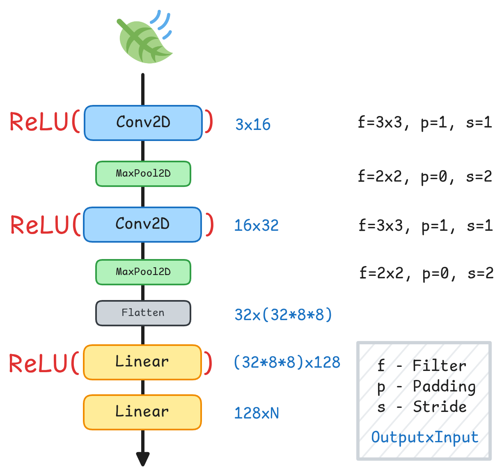

+++ { "part": "abstract" }

Plant diseases caused by infectious pathogens and feeding insects account for approximately 20% of global crop yield losses. Early detection and preventive measures are therefore critical to mitigating this impact. Among existing approaches, image-based plant disease classification using deep learning has emerged as a promising solution. In this work, we introduce MegaPlant, a consolidated leaf-image dataset designed to support plant disease classification models that generalize across diverse environmental conditions, from controlled laboratory settings to highly variable in-field scenarios. MegaPlant integrates multiple publicly available datasets and standardizes them into a unified [taxonomy](https://en.wikipedia.org/wiki/Taxonomy) of healthy and diseased leaf categories, enabling robust training across modalities. The dataset's utility was evaluated using a lightweight convolutional neural network (SimpleCNN) model. The dataset is benchmarked across three tasks: disease detection, symptom identification, and a combined disease–symptom classification task. Experimental results show that SimpleCNN achieves performance comparable to, and in some cases matching, high-performing and substantially larger models. These findings indicate that the MegaPlant dataset is a valuable resource for improving the training and generalization of future image-based plant disease classification models.

+++

# Background

Plant diseases are abnormal changes in appearance and behaviour that progresses over time, unlike plant injury that occurs immediately [@debusk2019plantpathogens].

::::{sidebar}
:::{iframe} https://www.youtube.com/embed/ZM2X-XBRKHM
:width: 100%
This video introduces various types of pathogens and their symptoms which are the causes of plant diseases.
:::
::::

These are caused by pathogens such as viruses, bacteria, fungus, oomycetes (fungus-like micro-organisms), parasitic nematodes (worm-like micro-organisms), and parasitic plants. Pathogens and pests ({abbr}`P&Ps (Pathogens and pests)`) account for about 20% and at least 10% of harvest yield loss in major crops [@https://doi.org/10.1038/s41559-018-0793-y; @10.1146/annurev.phyto.43.113004.133839, pg. 83].

:::::{figure}
:label: figure-1
:align: center


{term}`Morphology <morphology>` of various pathogens. (a) Pepper mild mottle virus [@10.1371/journal.pone.0010041, pg. 4]; (b) Cabbage afflicted with black rot marked XV [@https://doi.org/10.1016/B978-0-12-394807-6.00051-4]; (c) fungus on an infected host flower [@https://doi.org/10.1590/0100-5405/2101, pg. 258]; (d) oomycete "potato blight" _P. infestans_ [@https://doi.org/10.17582/journal.sja/2022/38.4.1189.1202, pg. 8]; (e) parasitic nematode [@https://doi.org/10.19080/ARTOAJ.2018.16.55580, pg. 36]; (f) parasitic plant "witchweed" _Striga_ [@https://www.doi.org/10.1016/B978-012373944-5.00344-8, pg. 617].

:::::

Although most diseases are caused by pathogens or {term}`biotic` factors, some are a result of direct injury or {term}`abiotic` factors, also called environmental factors. These factors are drought, winter, disruptive human activities, etc. Diseases caused by {term}`abiotic` factors are easier to diagnose but harder to control [@10.1016/B978-012373944-5.00344-8].

Considering that these pathogens are micro-organisms and invisible to the human eye, the method for identifying if a plant is unhealthy or infected is by identifying the symptoms and signs visually. However, identifying the exact disease-causing agent will require certain procedures often done by professional plant pathologists [@10.1146/annurev.phyto.43.113004.133839, pg. 96; @unh2015diagnosing].

## Symptoms

To diagnose a plant immediately is by looking at the symptoms, these symptoms are reactions of the plant to the pathogen, not necessarily a sign of the particular pathogen itself. Signs of a plant disease are physical evidence of the causal agent or pathogen, signs are not symptoms [@pennstate2017].

:::::{figure}
:label: figure-2
:align: center


Plants showing 9 of many symptoms observable by the human eye. (a) localized lesions caused by virus [@http://doi.org/10.1371/journal.pone.0010041], 4; (b) an apple exuding bacterial ooze, (c) scorched leaf symptoms caused by bacteria, (d) {term}`canker` on a leaf stem, (e) tomato ring malformations, (f) mosaic pattern symptom (g) dwarfism/stunted growth and bronzing caused by virus, (h) malformation and mosaic pattern symptoms, (i) tree bark afflicted with rot [@https://www.doi.org/10.1016/B978-012373944-5.00344-8, pg. 627-634].
:::::

Symptoms caused by {term}`abiotic` factors are referred to as disorders. These symptoms are usually uniform, affecting large or evenly distributed areas of vegetation. In contrast, diseases caused by pathogens are often non-uniform and appear as scattered or irregular patches in the field [@unh2015diagnosing].

With deep learning models that focus on visual inspection for plant disease detection, it may be more practical to determine if a plant is unhealthy or otherwise, rather than detecting specific diseases or disorders. For example, a deep learning model may classify a plant as unhealthy due to bronzing during autumn, but may be harder to determine what the disease or disorder is, without additional temporal or environmental context.

:::::{figure}
:label: figure-3
:align: center


{term}`Abiotic <abiotic>` versus {term}`biotic` induced symptoms.
(a) Total loss of a corn field due to drought [@independent2019cropinsurance]; (b) Dehydrated tree due to fungi inhibiting water passage to the tree branches [@10.1016/B978-012373944-5.00344-8, pg. 618].
:::::

[](#figure-3) shows the same symptoms in two different plants but caused by different factors. This shows that environmental context will be needed when diagnosing plant diseases. As such, this case study will focus only on identifying whether a plant is healthy or unhealthy based on the symptoms observed by the human eye.

## Signs

:::::{figure}
:label: figure-4
:align: center



Signs of the {abbr}`P&Ps (Pathogens and pests)` inflicting disease. (a) fungus growing as conks, (b) flagging, the insect feeding on the branch is highlighted, (c) powdery mildew appearance is composed of a fungus’ hyphae, (d) web-like hyphae of a fungus, (e) rusting and spores of a fungus, (f) japanese beetles feeding [@beckerman2022plantsymptoms].
:::::

Signs are physical evidence of the pathogen or pest, the real cause of the plant disease. Knowing the signs is key information to generating actions or solutions for {abbr}`P&P (Pathogens and pests)` management.

Observing the signs is a sure enough method to indicate that the plant might be unhealthy. However, that will take a more complex deep learning model, to consider another piece of information, for example, the bugs scattered on the branches, or fungus hyphae fully covering the subject leaf or plant. This study’s scope will only incorporate symptoms observed on the leaves and some simpler signs, like fungus mildew.

## Detection Methods

Plant disease detection can be performed using a range of approaches, from traditional manual observation to advanced computational techniques. Each method varies in accuracy, cost, scalability, and practicality depending on the use case.

### Manual and Laboratory Methods

Visual inspection is the most common and oldest method, where farmers or plant pathologists examine the visible symptoms on leaves, stems, or fruits such as spots, blight, or discoloration. Although simple and fast, this method is subjective and heavily reliant on human expertise and environmental conditions [@pennstate2017].

In laboratory diagnostics, several scientific tests are employed to accurately identify pathogens:

- **Microscopy** – Used to observe fungal spores or bacterial colonies.
- **Culture tests** – Pathogens are isolated and grown in nutrient media for species identification.
- **Serological tests (e.g., ELISA)** – Use antibodies to detect specific proteins associated with viruses or bacteria.
- **Molecular techniques (PCR, qPCR, LAMP)** – Detect pathogen DNA or RNA, offering high sensitivity and specificity [@http://doi.org/10.1111/j.1744-7348.2004.tb00354.x; @https://doi.org/10.1146/annurev.phyto.41.052002.095435].

While these approaches are precise, they require laboratory equipment, trained personnel, and are not suitable for large-scale or real-time monitoring.

### Image Processing

Before the advent of deep learning, plant disease detection often relied on handcrafted features derived from image processing.

Key features such as color, texture, and shape were extracted using algorithms like:

- Gray-Level Co-occurrence Matrix (GLCM) for texture analysis
- Local Binary Patterns (LBP) for surface variation
- Color histograms in RGB or HSV space for spotting discoloration

These features were then classified using traditional machine learning algorithms such as:

- Support Vector Machines (SVMs)
- k-Nearest Neighbors (k-NN)
- Random Forests
- Naïve Bayes classifiers

For example, [@https://doi.org/10.1016/j.compag.2006.01.004] demonstrated that SVM models using color and texture features achieved high accuracy in detecting citrus diseases. However, the performance of these systems is limited by the need for manual feature engineering, and they often fail to generalize well to diverse environmental conditions.

### Spectral and Sensor-Based Method

More recently, spectral imaging technologies such as hyperspectral, multispectral, and thermal imaging have been applied for early plant disease detection. These methods capture light reflectance across multiple wavelengths, including the visible, near-infrared (NIR), and thermal infrared regions. Diseased plants exhibit distinct reflectance patterns, enabling early detection even before visible symptoms appear [@https://doi.org/10.1094/PDIS-03-15-0340-FE].

Such approaches are commonly integrated into precision agriculture systems, where drones or UAVs collect large-scale field data. Despite their promise, these systems are often expensive, complex to analyze, and require specialized sensors, limiting their accessibility to smallholder farmers.

# Related Work

The related work and literature that will be discussed will be: (1) the recent advances and innovations in deep learning for plant leaf disease detection. (2) their downsides and limitations. (3) Existings datasets and their pros and cons.

## Recent Advances

Recent developments in deep learning have significantly improved plant leaf disease detection. Traditional CNNs such as VGG16 and ResNet are still widely used, but newer approaches focus on improving model accuracy, generalization, and field performance. One major advancement is the integration of attention mechanisms and Transformer-based models, which provide stronger feature extraction and robustness in real agricultural environments [@https://doi.org/10.3389/fpls.2024.1505857]. These models help address challenges like varying lighting and complex backgrounds, which often reduce CNN performance in real-field conditions [@https://doi.org/10.3390/jimaging11100326].
Another important trend is the development of lightweight and mobile-friendly architectures optimized for edge computing. Recent reviews highlight that compact CNN models can achieve high accuracy while being efficient enough for deployment on smartphones or IoT devices used in farms [@https://doi.org/10.1007/s10462-024-11100-x]. This allows farmers to detect diseases in real time without needing high-end hardware.
Researchers have also focused on multi-crop and large-scale datasets, enabling models to recognize multiple plant diseases across different species rather than being limited to one crop at a time [@https://doi.org/10.1186/s40537-025-01265-9]. This improves the practicality of deep learning models for real agricultural use.

## Current limitations

Although deep learning has significantly advanced plant disease detection, current innovations still face several unresolved limitations that are discussed in other research papers like [@https://doi.org/10.3389/fpls.2016.01419]. Many studies rely heavily on controlled or laboratory style datasets with uniform backgrounds, making models difficult to generalize to real-world field conditions when lighting, background, or leaf appearance changes. Our approach depends heavily on visual symptoms captured from lab images, field photos and stock images, yet its performance varies across these sources due to domain shift.

Existing models from other papers also struggle with domain shift, meaning a model trained on one environment or imaging condition often performs poorly when tested in another, this reflects a common limitation noted in [@https://doi.org/10.1016/j.compag.2018.01.009]. Our paper only focuses on identifying whether a plant is healthy or unhealthy based on the symptoms observed by the human eye, but we cannot reliably distinguish abiotic disorders from biotic diseases.

Studies like @https://doi.org/10.3389/fpls.2016.01419 and @https://doi.org/10.1016/j.compag.2018.01.009 show that accuracy can drop significantly when their models are evaluated outside their original training domain, indicating that many architectures are overfitted to specific datasets rather than truly learning robust, generalizable features. This becomes a serious problem for real-world deployment, because farmers and agricultural stakeholders often need a single system that can handle multiple crops, varying environments and different camera sources. Deploying smartphones or IoT devices used in farms @https://doi.org/10.1007/s10462-024-11100-x can actually help farmers to detect diseases in real time without needing high-end hardware.

Although our dataset includes multiple image sources, it remains limited in scale compared to the large, balanced datasets required for strong deep learning generalization. Many reviews, such as @https://doi.org/10.1007/s10462-024-11100-x similarly highlight that insufficient data diversity leads to reduced robustness in real-world agricultural settings.

In addition to data-related issues, computational demands also represent a major limitation. Many high-performing deep learning models require powerful GPUs, large memory capacity and stable internet connectivity, resources that are often unavailable to farmers, smallholder communities and agricultural workers in developing regions. @https://doi.org/10.32604/csse.2023.037992 emphasize that without lightweight and hardware-efficient solutions, the gap between technological innovation and real-world adoption remains wide.

In conclusion, these limitations show that while our approach demonstrates the potential of deep learning in multi-condition environments, the system still requires more diverse data, improved robustness to domain variability and integration of richer visual information to achieve reliable, field-ready performance.

## Known datasets

@https://doi.org/10.1145/3371158.3371196 proposed plant disease datasets have little diversity due to the laboratory conditions the image datasets were taken in, particularly datasets like the PlantVillage dataset by @https://doi.org/10.48550/arXiv.1511.08060. Their PlantDoc dataset improves upon this limitation but doesn’t account for images with uniform background in most of its diseased/unhealthy samples.

| Dataset      | Authors                                    | Description                                                 |
| ------------ | ------------------------------------------ | ----------------------------------------------------------- |
| PlantVillage | @https://doi.org/10.48550/arXiv.1511.08060 | Laboratory conditions, small images                         |
| PlantDoc     | @https://doi.org/10.1145/3371158.3371196   | Field and laboratory conditions, stock-photos, small images |
| DiaMOS       | @https://doi.org/10.3390/agronomy11112107  | Field conditions, large high quality images                 |

# MegaPlant Dataset

MegaPlant integrates leaf-image subsets from PlantVillage, PlantDoc, and DiaMOS to produce a model robust across varied imaging conditions. Only leaf images are included. PlantDoc and PlantVillage were obtained from their [Kaggle](https://www.kaggle.com/) derivatives due to issues accessing the original [GitHub](https://github.com/) repositories.

- (a) PlantDoc: [nirmalsankalana/plantdoc-dataset](https://www.kaggle.com/datasets/nirmalsankalana/plantdoc-dataset)
- (b) PlantVillage: [abdallahalidev/plantvillage-dataset](https://www.kaggle.com/datasets/abdallahalidev/plantvillage-dataset)
- (c) The DiaMOS dataset was retrieved directly from its [official repository](https://zenodo.org/records/5557313).

:::{table} Dataset Image counts
:label: table
:align: center

| Dataset      | Reported size | Retrieved images |
| ------------ | ------------- | ---------------- |
| DiaMOS       | 3,901         | 3,006            |
| PlantVillage | 54,305        | 54,306           |
| PlantDoc     | 2,598         | 2,598            |

:::

We obtained different image counts across repositories due to duplicates, corrupted files, dataset inconsistencies, and untracked modifications present in derivative versions of the datasets. To ensure consistency, we applied the constraint that only leaf images were included. Accordingly, from DiaMOS, we retrieved images only from the `leaves/` directory; from PlantDoc, only the `train/` and `test/` folders; and from PlantVillage, only the `color/` directory containing colored leaf images.

All images were consolidated and mapped into two primary classes: healthy (0) and unhealthy (1). The unhealthy category contains 12 symptom subclasses: blight, yellowing, malformation, powdery mildew, feeding, mold, mosaic, rot, rust, scab, scorch, and spot. We define the subclass criteria for dataset integration as follows:

1. If a folder is labeled with a subclass, all images within are assigned to that class.
2. Significant changes in leaf shape are classified as malformation.
3. Changes in leaf color (hue) are classified as yellowing.
4. Damage caused by insect feeding is classified as feeding.

An exception is Esca (Black Measles), which, despite its unique pathology, is labeled under the spot subclass. The final dataset was divided into train (70%), validation (20%), and test (10%) splits to enable reliable model evaluation and reduce bias.

# Modeling

Before training any model, we resize all input images to 32×32 pixels. Standardizing the input size allows the network to accommodate images of varying original dimensions without requiring architectural changes. After resizing, each RGB image is converted into a tensor of shape 3×32×32, which serves as the model’s input. A batch size of 32 will be used for mini-batching the images.

:::::{figure}
:label: figure-6
:align: center



A simple Convolutional Neural Network architecture (SimpleCNN)
:::::

This simple model is designed to be used on [edge devices](https://en.wikipedia.org/wiki/Edge_device) that often lack the computational power that more complex models need.

Throughout our experiments, we use a simple convolutional neural network architecture. [](#figure-6) details the layer configuration and corresponding dimensions. The output layer is adapted to each task, where $N$ is the number of output classes: for binary disease detection, the output dimension is 1; for multi-class symptom classification, it equals the number of symptom classes; and for the combined task, the model outputs the number of symptom classes plus one additional healthy class.

The network was trained using Stochastic Gradient Descent for the optimization algorithm with a learning rate of {math}`0.01` with {math}`50` epochs. We use ReLU as our activation function [@10.48550/arXiv.1803.08375]. We use Mean Square Error and Cross Entropy as the loss function when doing binary classification or multi-class classification.

```{math}
:label: classification-threshold
y =
\begin{cases}
1, & \text{if z } \ge i \\
0, & \text{else}
\end{cases}
```

During inference, we classify the logits as either healthy or unhealthy using a {math}`0.5` classification threshold.

## System Configuration

All experiments were conducted using PyTorch [@10.48550/arXiv.1912.01703] on an NVIDIA 1050 Ti GPU (driver version 535.247.01) with CUDA 12.2.
The machine that was used had 32 GB of RAM and an AMD Ryzen 5 5600 6-Core Processor.

# Results and Discussion

We perform three main tasks and evaluate their performance on the MegaPlant dataset. Disease detection for binary classification, symptom identification for multi-class classification, and a combined task approach for multi-class classification of both symptoms and a healthy class.

We evaluate model performance using the F1-score and accuracy, as these metrics are the most commonly reported in prior work on plant disease image classification, thereby ensuring direct comparability and reproducibility of our results. Accuracy quantifies the overall proportion of correctly classified samples and is defined as the ratio of true predictions to the total number of predictions. The F1-score provides a balanced assessment of a model’s predictive capability by combining precision and recall into a single harmonic mean, making it particularly suitable for datasets with class imbalance.

```{math}
:label: accuracy

\begin{equation}
\text{Accuracy} = \frac{TP + TN}{TP + TN + FP + FN}
\end{equation}

```

```{math}
:label: precision

\begin{equation}
\text{Precision} = \frac{TP}{TP + FP}
\end{equation}


```

```{math}
:label: recall

\begin{equation}
\text{Recall} = \frac{TP}{TP + FN}
\end{equation}


```

```{math}
:label: f1-score

\begin{equation}
\text{F1-score} = 2 \cdot \frac{\text{Precision} \cdot \text{Recall}}{\text{Precision} + \text{Recall}}
\end{equation}


```

In these metrics, true positives (TP) refer to samples that are correctly classified as belonging to the positive class, true negatives (TN) denote samples correctly classified as belonging to the negative class, false positives (FP) represent negative samples that are incorrectly classified as positive, and false negatives (FN) indicate positive samples that are incorrectly classified as negative. These quantities form the basis for computing accuracy, precision, recall, and the F1-score.

For computing evaluation metrics, we rely on the [scikit-learn](https://scikit-learn.org/stable/) Python library, which provides standardized implementations of accuracy, F1 score, and other commonly used performance measures [@Pedregosa_Scikit-learn_Machine_Learning_2011]. 

## Disease Detection

We aim to detect diseases regardless of the type of symptoms or stresses present on the leaf. We perform binary disease detection on the three datasets after training using the MegaPlant dataset. We only use 1 output dimension to represent the binary class prediction.

:::{table} Performance of Disease Detection with SimpleCNN
:label: table-2
:align: center

| Dataset      | F1 Score | Accuracy |
| ------------ | -------- | -------- |
| DiaMOS       | 0.9918   | 0.9837   |
| PlantVillage | 0.9901   | 0.9856   |
| PlantDoc     | 0.8954   | 0.8392   |

:::

SimpleCNN achieves an accuracy of 98.07% on the test set, an F1 score of 0.98, with a parameter count of 267,489. [](#table-2) also shows the performance on each foundational dataset. The scores across seem balanced and indicates decent generalization of the model.

## Symptom Identification

Our goal is to identify a diseased leaf's symptom or present stressor, making this a multi-class classification task. This model only inputs diseased leaves and will not be trained with healthy leaves. As such, we only use 12 output classes for this for the twelve symptoms.

:::{table} Performance of Symptom Identification with SimpleCNN
:label: table-3
:align: center

| Dataset      | F1 Score | Accuracy |
| ------------ | -------- | -------- |
| DiaMOS       | 0.8919   | 0.8853   |
| PlantVillage | 0.9302   | 0.9305   |
| PlantDoc     | 0.7692   | 0.7569   |

:::

SimpleCNN achieves an accuracy of 93.86% on the test set, an F1 score of 0.95, with a parameter count of 268,908. [](#table-3) also shows the performance on each foundational dataset. The scores across seem to favor PlantVillage considering that it composes the biggest portion of the MegaPlant dataset.

PlantDoc authors @Singh_2020 [pg. 3] used a variation of a ResNet model [@https://doi.org/10.48550/arXiv.1512.03385] to perform symptom identification with a performance 70.53% accuracy and 0.70 F1 score. Our model performs better on the PlantDoc dataset with a superior 75.69% accuracy and 0.7692 F1 score. Our model generalized better when incorporating other datasets to train a model.

## Combined tasks

This approach combines both disease detection and symptom identification into one model. Alongside the 12 symptom classes, we add another 'healthy` class, bringing the total output dimensions to 13.

:::{table} Performance of combined task classification with SimpleCNN of 13 output classes
:label: table-4
:align: center

| Dataset      | F1 Score | Accuracy | Binary F1 Score | Binary Accuracy |
| ------------ | -------- | -------- | --------------- | --------------- |
| DiaMOS       | 0.8705   | 0.8666   | 0.9942          | 0.9886          |
| PlantVillage | 0.9475   | 0.9478   | 0.9934          | 0.9905          |
| PlantDoc     | 0.7897   | 0.7754   | 0.9477          | 0.9242          |

Binary F1 Score and Accuracy are derived from the model’s outputs, where all symptom-present cases are mapped to the unhealthy/diseased class (1), and all healthy cases are mapped to the healthy class (0). This makes it easier to compare against disease detection models.

:::

SimpleCNN achieves an accuracy of 95.12% on the test set, an F1 score of 0.95, with a parameter count of 269,037. [](#table-3) also shows the performance on each foundational dataset. The scores across seem to favor PlantVillage considering that it composes the biggest portion of the MegaPlant dataset.

Our model performs better relative to the EfficientNetB0 model evaluated by the authors of DiaMOS [@10.48550/arXiv.1905.11946, pg. 6] with an accuracy 86.05% trained for both disease detection and symptom identification.

On par with GoogleNET, a network with more than 3 million parameters with an accuracy of 99% trained for the same task [@10.1109/CVPR.2015.7298594; @10.3389/fpls.2016.01419, pg. 7]. Another similar methodology used a hybrid of a convolutional network and a support vector machine that performs with 99% accuracy [@10.3389/fpls.2024.1412988, pg. 15].

## Limitations

Symptom identification may fail in cases where multiple disease symptoms are simultaneously present on a single leaf. Since overlapping visual features can confuse the classifier, this limitation could lead to incorrect or incomplete diagnoses, which is particularly critical for real-world agricultural applications where co-infections are common.

# Conclusion

We introduced the basics of plant pathology to give an idea of where our case study might be situated in the research field. We discussed what symptoms are and how our case study approaches the problem of detecting plant diseases by detecting the symptoms visually. We identified traditional and alternative methods of plant disease detection. These methods often required feature engineering steps or expensive requirement

We presented the MegaPlant dataset and described the SimpleCNN model used to evaluate its effectiveness. The dataset was assessed across three tasks: disease detection, symptom identification, and a combined disease–symptom classification task. The results demonstrate that the proposed model achieves performance comparable to, and in some cases on par with, high-performing and often larger models. Furthermore, we showed that the MegaPlant dataset has strong potential to improve the future training performance of image classification models for plant disease analysis.

:::{glossary}
abiotic
: physical components of the environment that affect living organisms. - [Wikipedia](https://en.wikipedia.org/wiki/Abiotic_component)

biotic
: living components of the environment, living organisms. - [Wikipedia](https://en.wikipedia.org/wiki/Biotic)

canker
: Sunken necrotic patch of bark [@beckerman2022plantsymptoms, pg. 9].

morphology
: in biology, is the study of the size, shape, and structure of animals, plants, and microorganisms and of the relationships of their constituent parts. - [Britannica](https://www.britannica.com/science/morphology-biology)
:::

+++ { "part": "availability" }

The MegaPlant dataset is hosted in a HuggingFace dataset repository can be retrieved from this link: https://huggingface.co/datasets/chrisandrei/MegaPlant. All relevant Python code, Jupyter notebooks, notes, and references can be found in this git repository hosted on GitHub: https://github.com/iragca/DS413-final-project.

+++

+++ { "part": "acknowledgements" }

This work benefited from the assistance of large language models for tasks such as literature discovery, writing support, and code autocompletion. All research ideas and methodological decisions were conceived and developed by the authors, with inspiration drawn from relevant prior work.

+++
