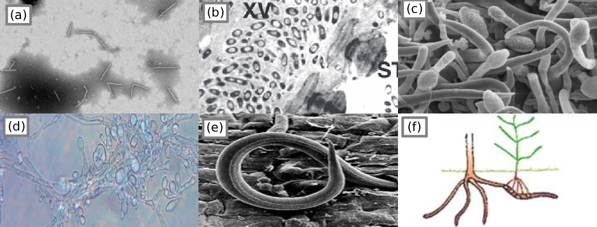
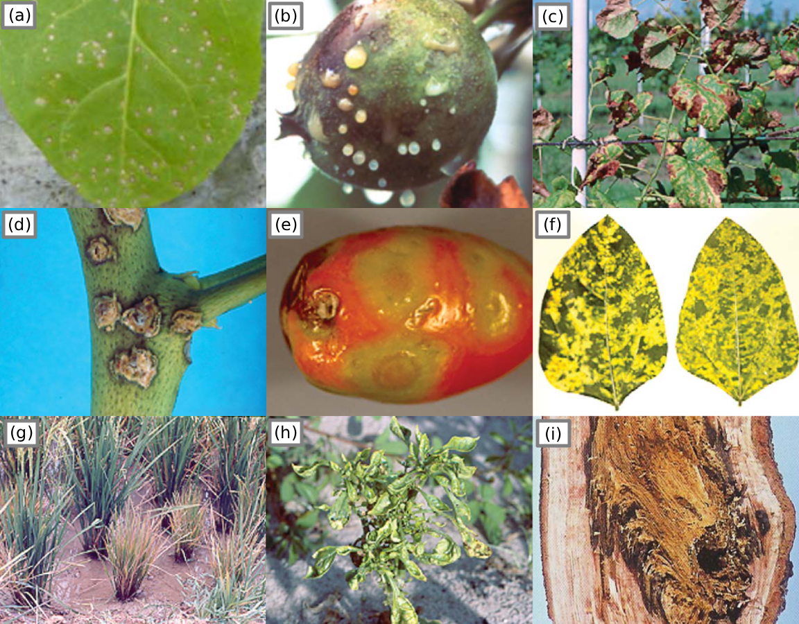
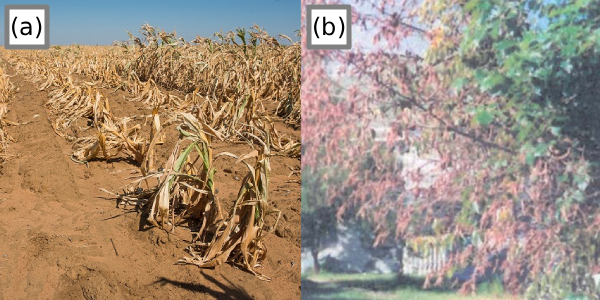

+++ { "part": "abstract" }

We propose a case study of applying deep learning in plant disease detection under multiple conditions as part of our coursework in DS413 Deep Learning. We introduce as a background what plant symptoms are and how our case study tackles the issue of visually identifying plant illnesses. We identified both conventional and unconventional plant disease detection techniques. The shortcomings and advantages of recent advancements in deep learning-based plant disease detection were examined, and we learned how we might approach the challenge of deep learning-based plant disease detection, especially on datasets of leaf images under various conditions, such as laboratory, field, and stock images.

+++

# Background

Plant diseases are abnormal changes in appearance and behaviour that progresses over time, unlike plant injury that occurs immediately ([DeBusk, 2019](https://www.youtube.com/watch?v=ZM2X-XBRKHM)).

:::{iframe} https://www.youtube.com/embed/ZM2X-XBRKHM
:width: 100%
This video introduces various types of pathogens and their symptoms which are the causes of plant diseases.
:::

These are caused by pathogens such as viruses, bacteria, fungus, oomycetes (fungus-like micro-organisms), parasitic nematodes (worm-like micro-organisms), and parasitic plants. Pathogens and pests (P&Ps) account for about 20% and at least 10% of harvest yield loss in major crops ([Savary et al., 2019, 1](https://doi.org/10.1038/s41559-018-0793-y); [Strange & Scott, 2005, 83](http://doi.org/10.1146/annurev.phyto.43.113004.133839)).

:::::{figure}
:label: figure-1
:align: center

Morphology[^morphology] of various pathogens. (a) Pepper mild mottle virus ([Colson et al., 2010, 4](http://doi.org/10.1371/journal.pone.0010041)); (b) Cabbage afflicted with black rot marked XV ([Dow et al., 2016](https://doi.org/10.1016/B978-0-12-394807-6.00051-4)); (c) fungus on an infected host flower ([Pinto et al., 2016, 258](https://doi.org/10.1590/0100-5405/2101)); (d) oomycete "potato blight" *P. infestans* [Raza et al., 2022, 8](https://doi.org/10.17582/journal.sja/2022/38.4.1189.1202); (e) parasitic nematode ([Mitiku, 2018, 36](https://doi.org/10.19080/ARTOAJ.2018.16.55580)); (f) parasitic plant "witchweed" *Striga* ([Agrios, 2009, 617](https://www.doi.org/10.1016/B978-012373944-5.00344-8)).

:::::

[^morphology]: **morphology**, in biology, is the study of the size, shape, and structure of animals, plants, and microorganisms and of the relationships of their constituent parts. - [www.britannica.com](https://www.britannica.com/science/morphology-biology)

Although most diseases are caused by pathogens or biotic factors, some are a result of direct injury or abiotic factors, also called environmental factors. These factors are drought, winter, disruptive human activities, etc. Diseases caused by abiotic factors are easier to diagnose but harder to control ([Agrios, 2009, 613](https://www.doi.org/10.1016/B978-012373944-5.00344-8)).

Considering that these pathogens are micro-organisms and invisible to the human eye, the method for identifying if a plant is unhealthy or infected is by identifying the symptoms and signs visually. However, identifying the exact disease-causing agent will require certain procedures often done by professional plant pathologists ([Strange & Scott, 2005, 96](http://doi.org/10.1146/annurev.phyto.43.113004.133839); [UNH Extension, 2015](https://www.youtube.com/watch?v=7HnLVYhvars)).

## Symptoms

To diagnose a plant immediately is by looking at the symptoms, these symptoms are reactions of the plant to the pathogen, not necessarily a sign of the particular pathogen itself. Signs of a plant disease are physical evidence of the causal agent or pathogen, signs are not symptoms ([Penn State Extension, 2017](https://www.youtube.com/watch?v=m6GoSy8RjUM)).

:::::{figure}
:label: figure-2
:align: center

Plants showing 9 of many symptoms observable by the human eye. (a) localized lesions caused by virus ([Colson et al., 2010](http://doi.org/10.1371/journal.pone.0010041)), 4; (b) an apple exuding bacterial ooze, (c) scorched leaf symptoms caused by bacteria, (d) canker on a leaf stem, (e) tomato ring malformations, (f) mosaic pattern symptom (g) dwarfism/stunted growth and bronzing caused by virus, (h) malformation and mosaic pattern symptoms, (i) tree bark afflicted with rot ([Agrios, 2009, 627-634](https://www.doi.org/10.1016/B978-012373944-5.00344-8)).
:::::

Symptoms caused by abiotic factors are referred to as disorders. These symptoms are usually uniform, affecting large or evenly distributed areas of vegetation. In contrast, diseases caused by pathogens are often non-uniform and appear as scattered or irregular patches in the field ([UNH Extension, 2015](https://www.youtube.com/watch?v=7HnLVYhvars)). With deep learning models that focus on visual inspection for plant disease detection, it may be more practical to determine if a plant is unhealthy or otherwise, rather than detecting specific diseases or disorders.

For example, a deep learning model may classify a plant as unhealthy due to bronzing during autumn, but may be harder to determine what the disease or disorder is, without additional temporal or environmental context.

:::::{figure}
:label: figure-3
:align: center

Abiotic versus biotic induced symptoms.
(a) Total loss of a corn field due to drought ([The Independent, 2019](https://www.independent.co.ug/130-drought-affected-farmers-benefit-from-crop-insurance/)); (b) Dehydrated tree due to fungi inhibiting water passage to tree branches ([Agrios, 2009, 618](https://www.doi.org/10.1016/B978-012373944-5.00344-8)).
:::::

 shows the same symptoms in two different plants but caused by different factors. This shows that environmental context will be needed when diagnosing plant diseases. As such, this case study will focus only on identifying whether a plant is healthy or unhealthy based on the symptoms observed by the human eye.

## Signs

:::::{figure}
:label: figure-4
:align: center

Signs of the P&Ps inflicting disease ([Beckerman & Creswell, 2022](https://www.extension.purdue.edu/extmedia/BP/BP-164-W.pdf))
:::::

Signs are physical evidence of the pathogen or pest, the real cause of the plant disease. Knowing the signs are key information to generating actions or solutions for P&P management.

Observing the signs is a sure enough method to indicate that the plant might be unhealthy. However, that will take a more complex deep learning model, to consider another piece of information, for example, the bugs scattered on the branches, or fungus hyphae fully covering the subject leaf or plant. This study’s scope will only incorporate symptoms observed on the leaves and some simpler signs, like fungus mildew.

## Detection Methods

### Manual and Laboratory Methods

### Image Processing

### Spectral and Sensor-Based Method

# Recent Advances

# Current limitations

# Methodology

## Splits

# Objectives

# Summary
