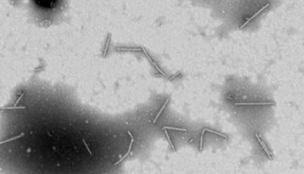
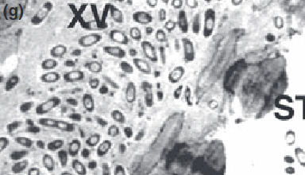
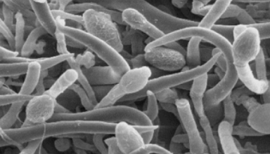

+++ { "part": "abstract" }

We propose a case study of applying deep learning in plant disease detection under multiple conditions as part of our coursework in DS413 Deep Learning. We introduce as a background what plant symptoms are and how our case study tackles the issue of visually identifying plant illnesses. We identified both conventional and unconventional plant disease detection techniques. The shortcomings and advantages of recent advancements in deep learning-based plant disease detection were examined, and we learned how we might approach the challenge of deep learning-based plant disease detection, especially on datasets of leaf images under various conditions, such as laboratory, field, and stock images.

+++

# Background

Plant diseases are abnormal changes in appearance and behaviour that progresses over time, unlike plant injury that occurs immediately ([DeBusk, 2019](https://www.youtube.com/watch?v=ZM2X-XBRKHM)).

:::{iframe} https://www.youtube.com/embed/ZM2X-XBRKHM
:width: 100%
This video introduces various types of pathogens and their symptoms which are the causes of plant diseases.
:::

These are caused by pathogens such as viruses, bacteria, fungus, oomycetes (fungus-like micro-organisms), parasitic nematodes (worm-like micro-organisms), and parasitic plants. Pathogens and pests (P&Ps) account for about 20% and at least 10% of harvest yield loss in major crops ([Savary et al., 2019, 1](https://doi.org/10.1038/s41559-018-0793-y); [Strange & Scott, 2005, 83](http://doi.org/10.1146/annurev.phyto.43.113004.133839)).

:::::{figure}
:label: figure-1
:align: center

(ppmov)=

Morphology[^morphology] of various pathogens. (a) [Colson et al., 2010, 4](http://doi.org/10.1371/journal.pone.0010041); (b) [Dow et al., 2016](https://doi.org/10.1016/B978-0-12-394807-6.00051-4); (c) [Pinto et al., 2016, 258](https://doi.org/10.1590/0100-5405/2101); (d) [Raza et al., 2022, 8](https://doi.org/10.17582/journal.sja/2022/38.4.1189.1202); (e) [Mitiku, 2018, 36](https://doi.org/10.19080/ARTOAJ.2018.16.55580); (f) [Agrios, 2009, 617](https://www.doi.org/10.1016/B978-012373944-5.00344-8).

:::::

[^morphology]: **morphology**, in biology, is the study of the size, shape, and structure of animals, plants, and microorganisms and of the relationships of their constituent parts. - [www.britannica.com](https://www.britannica.com/science/morphology-biology)

See  for the fruit, and  to reference both subfigures.
